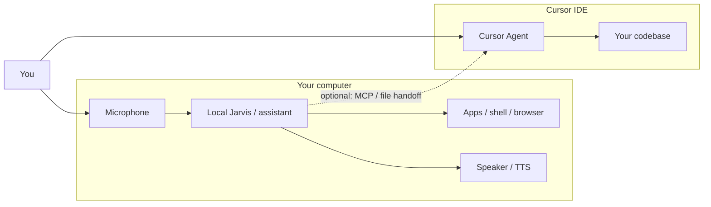

# Jarvis — desktop assistant + Cursor integration

This repo is a **starting point** for the “Jarvis on my computer” setup you see in videos: always-on (or push-to-talk) voice, natural replies, and tools that can run apps, shell commands, and web lookups. It also documents how to pair that with **Cursor** (this AI coding agent) and **lifelike voice** (TTS).

## What I can and cannot do from the cloud

| Capability | Cloud Agent (Cursor in the browser/cloud) | This repo (on **your** machine) |
|------------|-------------------------------------------|----------------------------------|
| Hear you / speak back | No — runs remotely | Yes — with mic + speakers |
| Control your OS 24/7 | No | Yes — with local tools + permissions |
| Write code in your project | Yes | Via Cursor separately |
| Lifelike voice | N/A | Yes — ElevenLabs, OpenAI TTS, Edge TTS, etc. |

**Bottom line:** The “Jarvis running your computer” experience must run **locally**. Cursor is the best brain for **coding**; a local assistant (or a mature open-source Jarvis) is the best brain for **voice + OS control**. You can use both together (see [docs/CURSOR.md](docs/CURSOR.md)).

## Three paths (pick one)

### Path A — Fastest (matches most YouTube demos)

Install a mature open-source desktop Jarvis and skip writing your own:

| Project | Best for | Voice | Computer control | Link |
|---------|----------|-------|------------------|------|
| **[isair/jarvis](https://github.com/isair/jarvis)** | Private, voice-first, MCP tools, offline option | Built-in | Chrome, screen, nutrition, MCP | [Releases](https://github.com/isair/jarvis/releases) |
| **[open-jarvis/OpenJarvis](https://github.com/open-jarvis/OpenJarvis)** | Research-grade local+cloud, presets | Morning digest TTS, voice extras | Agents, shell, files | [Docs](https://open-jarvis.github.io/OpenJarvis/) |
| **[kishanrajput23/Jarvis-Desktop-Voice-Assistant](https://github.com/kishanrajput23/Jarvis-Desktop-Voice-Assistant)** | Simple Python tutorial | `pyttsx3` | Open sites/apps | MIT, beginner-friendly |

**Recommendation:** Start with **isair/jarvis** if you want something closest to “third person in the room” with MCP. Use **OpenJarvis** if you want local LLMs (Ollama) and hybrid cloud/local agents.

### Path B — This repo’s minimal assistant (learn + customize)

A small Python loop: **listen → think (LLM + tools) → speak**.

```bash
cd assistant
python -m venv .venv
source .venv/bin/activate   # Windows: .venv\Scripts\activate
pip install -r requirements.txt
cp ../.env.example ../.env   # add API keys
python main.py
```

Details: [docs/SETUP.md](docs/SETUP.md) · Voice quality: [docs/VOICE.md](docs/VOICE.md)

### Path C — Cursor + voice only (coding assistant, not full Jarvis)

Keep Cursor as the agent; add **speech-to-text** (and optionally **text-to-speech**) inside the IDE:

- **[Spokenly](https://spokenly.app/speech-to-text-cursor)** — local Whisper, MCP so the agent can ask you questions by voice
- **[Dictator](https://github.com/tahaabbas/dictator)** — mic in chat, local Whisper in browser
- **[codecall](https://github.com/TN0123/codecall)** — “call” UI with **ElevenLabs** for lifelike multi-agent voice

Details: [docs/CURSOR.md](docs/CURSOR.md)

## Suggested combined stack (coding + Jarvis)



1. **Daily voice + PC tasks** → Path A or Path B on your machine.  
2. **Build and refactor software** → Cursor with Path C voice input.  
3. **Bridge** → Local Jarvis opens Cursor, passes task files, or you say “open Cursor and fix the auth bug” as a scripted tool.

## Lifelike communication (voice that sounds human)

| Tier | Service | Quality | Cost | Notes |
|------|---------|---------|------|-------|
| Best | [ElevenLabs](https://elevenlabs.io) | Very natural | Paid | Used by many “Jarvis” demos; streaming API |
| Great | OpenAI `tts-1-hd` | Natural | Paid | Simple API, good latency |
| Good free | Microsoft Edge TTS (`edge-tts`) | Decent | Free | Default in this repo’s sample |
| Basic | `pyttsx3` | Robotic | Free | Fine for prototypes only |

See [docs/VOICE.md](docs/VOICE.md) for wiring ElevenLabs or OpenAI into `assistant/voice.py`.

## Security

Local assistants can run shell commands and open apps. Only enable tools you trust, use OS permissions mindfully, and never commit API keys (use `.env`).

## License

Documentation and sample code in this repo: MIT. Third-party projects linked above use their own licenses.
