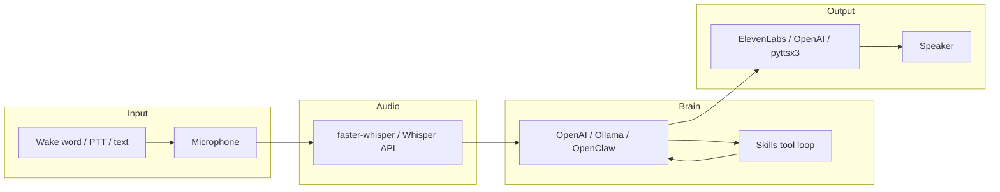
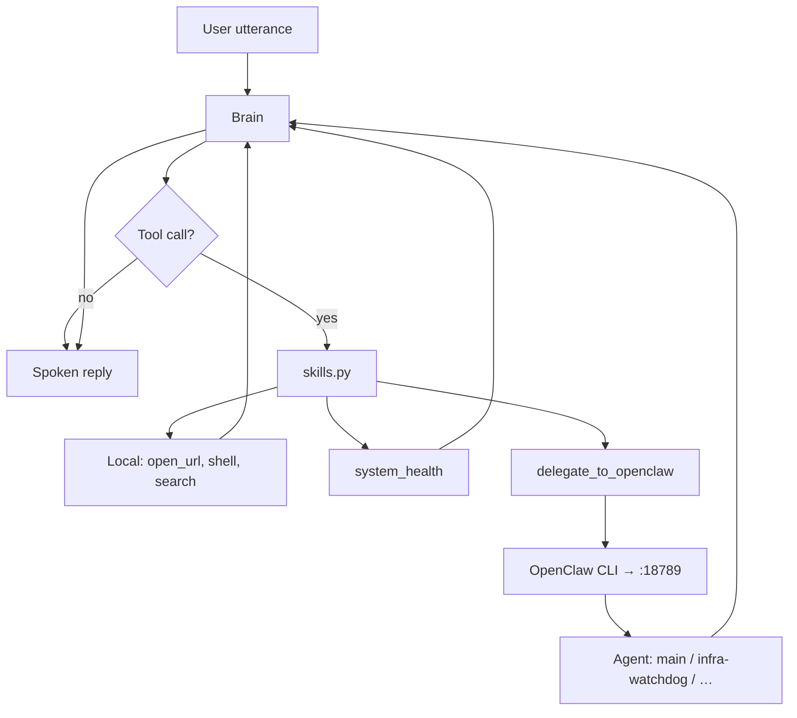
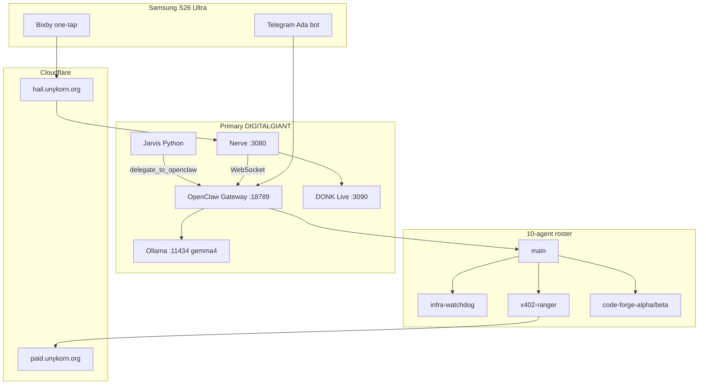
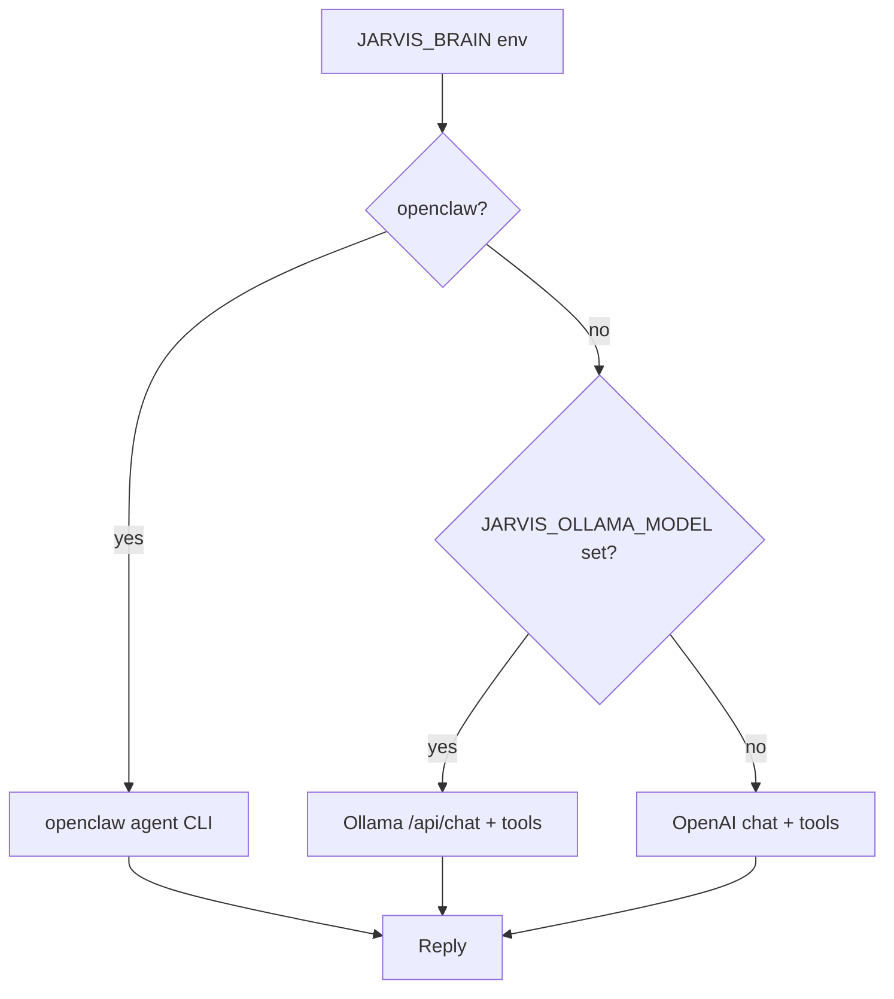
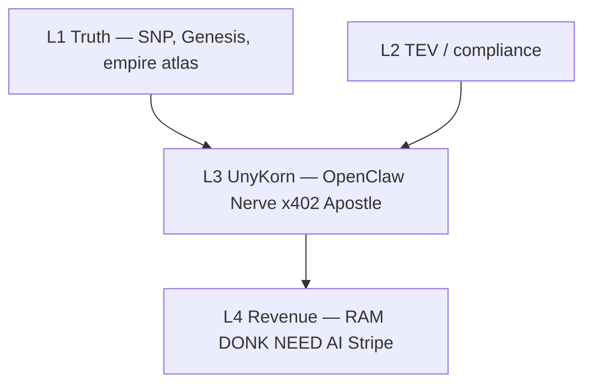

# Flowcharts

## Voice loop (Jarvis repo)

## Skill routing

## OpenClaw mesh delegation

## Brain backend selection

## FTH four-layer stack (context)

See [FTH_SYSTEM_CONTEXT.md](FTH_SYSTEM_CONTEXT.md) for ports and agents.
